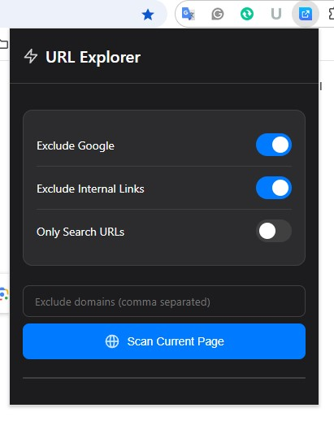

# URL Export - Chrome Extension FREE

## Description

**URL Export** is a free and easy-to-use Chrome extension that helps you explore and export URLs from any webpage with just a few clicks. Whether you're managing links for a project, analyzing web pages, or simply organizing resources, this tool makes the process quick and efficient.

The extension offers customizable filters to refine your results, allowing you to exclude unwanted domains, filter Google links, and focus only on the URLs that matter to you.

Best of all, **URL Export** is completely free and available to everyone!

## Features

- **Exclude Google Links**: Remove all links pointing to Google domains.
- **Exclude Internal Links**: Filter out internal links within the same domain.
- **Only Search URLs**: Focus exclusively on search-related URLs.
- **Exclude Specific Domains**: Enter custom domains (comma-separated) to exclude them from your results.
- **Scan Current Page**: Instantly scan the current page and extract filtered URLs.

## How to Use

1. **Download the Extension**:
   - Click the "[Download](https://github.com/imustafijur/ULR-Export-Chrome-Extensions/releases)" button on this page to get the extension files.

2. **Install the Extension in Chrome**:
   - Open Chrome and go to `chrome://extensions/`.
   - Enable "Developer mode" by toggling the switch in the top right corner.
   - Click "Load unpacked" and select the folder where you downloaded the extension files.

3. **Access the Extension**:
   - Once installed, click the **URL Export** icon in your Chrome toolbar to open the interface.

4. **Configure Filters and Scan**:
   - Adjust the settings based on your needs (e.g., exclude Google links, specific domains, etc.).
   - Click the "Scan Current Page" button to extract the URLs.
   - Copy or save the filtered URLs for your use.

## Why Use URL Export?

- **Simple and Intuitive**: No technical expertise required—just install, configure, and scan!
- **Customizable Filters**: Tailor the results to your specific needs.
- **Free for Everyone**: No hidden costs or premium features—everything is available for free.
- **Lightweight and Fast**: The extension works seamlessly without slowing down your browser.

## Who Can Benefit?

- **Web Developers**: Quickly extract and analyze URLs for debugging or optimization.
- **Content Creators**: Organize and manage resources for your projects.
- **Researchers**: Collect and filter relevant links for analysis.
- **Everyday Users**: Save time by extracting only the links you need.

## Download

You can download the latest version of **URL Export** directly from this page. Simply click the link below:

[Download URL Export](https://github.com/imustafijur/ULR-Export-Chrome-Extensions/releases)

## Support

If you encounter any issues or have suggestions for improvement, feel free to reach out! You can contact us at [info@soovex.com](mailto:info@soovex.com).

We appreciate your feedback and are committed to making **URL Export** even better for everyone.

## License

This project is licensed under the MIT License. Feel free to use, modify, and distribute it as needed.
